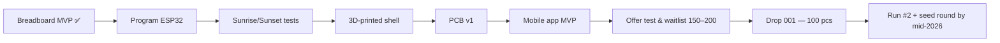

<!-- Header -->
<h1 align="center">Hi, I'm Sofia — maker of calm tech ✦</h1>
<p align="center">
  <strong>Building sleep-first smart lamps • Indie hardware • Creative coding</strong><br/>
  <em>From the Alps to electronics — turning insomnia into interfaces.</em>
</p>

<!-- Brand colors: red / black / gold -->
<p align="center">
  
  
  
</p>

<!-- SEO style categories -->
<p align="center">| Startup | Indie Hardware | IoT | ESP32 | SleepTech | Product Design |</p>

---

### TL;DR
- 🛠️ **Now**: prototyping a **dimmable smart lamp** (ESP32 + RTC) with sunrise/sunset, sleep detection, touch control, app.
- 🎮 **Side quest**: a mini **Mario-style game** hand-drawn for my partner’s birthday — and his on-camera reaction.
- 🏔️ From a tiny Lombard Alps town → architecture degree (97/110) → rendering studio → hardware + marketing.

### Tech I use
`JS` `HTML` `CSS` `Python (learning)` `C/Arduino` `ESP32` `KiCad` `3D printing` `Blender` `Figma`

### Tattoo code (true story)
```js
const dreamLife = "girlBoss";
function businessBooming () {
  var output = "";
  if (typeof dreamLife !== "undefined") { output = "I am a " + dreamLife; }
  console.log(output);
}
businessBooming();
```
### Next step

