<!-- Header -->
<h1 align="center">Hi, I'm Sofia — maker of calm tech ✦</h1>
<p align="center">
  <strong>Developing <em>Lullaby — Founders Edition (100)</em></strong><br/>
  <em>Sleep-first smart lamp • From the Alps to electronics — turning insomnia into interfaces.</em>
</p>

<!-- Brand colors: red / black / gold -->
<p align="center">
  
  
  
</p>

<!-- SEO style categories -->
<p align="center">| Startup | Indie Hardware | IoT | ESP32 | SleepTech | Product Design |</p>

---

### TL;DR
- 🛠️ **Now**: developing **Lullaby**, a sleep-first dimmable smart lamp (ESP32 + RTC) with sunrise/sunset, sleep-aware fade-out, touch control, and app (v1).
- 🎮 **Side quest**: a hand-drawn **Mario-style** mini-game for my partner’s birthday — filming the reaction.
- 🏔️ Tiny Lombard Alps town → Architecture (97/110) → arch-viz studio → hardware + marketing.

### Tech I use
`JS` `HTML` `CSS` `Python (learning)` `C/Arduino` `ESP32` `KiCad` `3D printing` `Blender` `Figma`

### Tattoo code (true story)
```js
const dreamLife = "girlBoss";
function businessBooming () {
  var output = "";
  if (typeof dreamLife !== "undefined") { output = "I am a " + dreamLife; }
  console.log(output);
}
businessBooming();
```

### Next step

```mermaid
  graph LR
  A["Breadboard MVP ✅"] --> B["Mobile app MVP"]
  B --> C["Program ESP32"]
  C --> D["Sunrise/Sunset tests"]
  D --> E["3D-printed shell"]
  E --> F["PCB v1"]
  F --> G["Offer test & waitlist 150–200"]
  G --> H["Drop 001 — 100 pcs"]
  H --> I["Run #2 + seed round by mid-2026"]



```


### Early access / contact

<!-- 🔗 Sostituisci FORM_URL con il link reale del tuo form -->
<p align="center"><a href="https://lullaby.kit.com/form?utm_source=github&utm_medium=readme&utm_campaign=drop001_waitlist"></a>&nbsp;<a href="https://www.instagram.com/sophiasdiares/"></a>&nbsp;<a href="https://www.tiktok.com/@sophiasdiares"></a>&nbsp;<a href="mailto:sofia.vanotti@gmail.com?subject=Lullaby%20—%20Drop%20001&body=Hi%20Sofia,%20I%E2%80%99m%20interested%20in%20Lullaby."></a></p>


**No waitlist yet?** DM **“Lullaby”** on IG/TikTok and I’ll notify you when **Drop 001 (100 units)** opens.

For **investors / media** → email: `sofia.vanotti@gmail.com`

